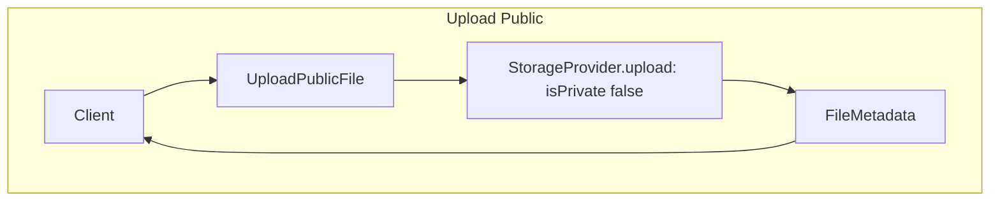
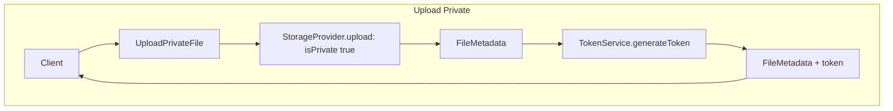
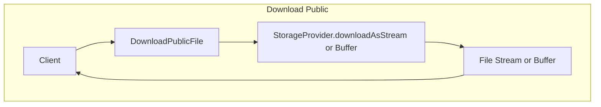
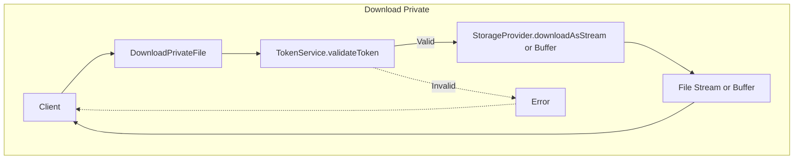

## Use Case Flows

### 1. Upload Public File

**Actors:** Client, [`UploadPublicFile`](src/application/UploadPublicFile.ts), [`StorageProvider`](src/interfaces/StorageProvider.ts)

**Flow:**
1. Client calls `UploadPublicFile.execute(params)`.
2. [`UploadPublicFile`](src/application/UploadPublicFile.ts) calls [`StorageProvider.upload`](src/interfaces/StorageProvider.ts) with `isPrivate: false`.
3. [`StorageProvider`](src/interfaces/StorageProvider.ts) implementation (e.g., [`LocalStorageProvider`](src/infrastructure/LocalStorageProvider.ts) or [`GCSStorageProvider`](src/infrastructure/GCSStorageProvider.ts)) stores the file and returns [`FileMetadata`](src/domain/FileMetadata.ts).
4. [`UploadPublicFile`](src/application/UploadPublicFile.ts) returns the metadata to the client.

---

### 2. Upload Private File

**Actors:** Client, [`UploadPrivateFile`](src/application/UploadPrivateFile.ts), [`StorageProvider`](src/interfaces/StorageProvider.ts), [`TokenService`](src/interfaces/TokenService.ts)

**Flow:**
1. Client calls `UploadPrivateFile.execute(params)` (may include `tokenPayload`).
2. [`UploadPrivateFile`](src/application/UploadPrivateFile.ts) calls [`StorageProvider.upload`](src/interfaces/StorageProvider.ts) with `isPrivate: true`.
3. [`StorageProvider`](src/interfaces/StorageProvider.ts) implementation stores the file and returns [`FileMetadata`](src/domain/FileMetadata.ts).
4. [`UploadPrivateFile`](src/application/UploadPrivateFile.ts) calls [`TokenService.generateToken`](src/interfaces/TokenService.ts) with the payload.
5. [`UploadPrivateFile`](src/application/UploadPrivateFile.ts) returns the metadata (with `token`) to the client.

---

### 3. Download Public File

**Actors:** Client, [`DownloadPublicFile`](src/application/DownloadPublicFile.ts), [`StorageProvider`](src/interfaces/StorageProvider.ts)

**Flow:**
1. Client calls `DownloadPublicFile.asStream(params)` or `.asBuffer(params)`.
2. [`DownloadPublicFile`](src/application/DownloadPublicFile.ts) calls the corresponding [`StorageProvider`](src/interfaces/StorageProvider.ts) method.
3. [`StorageProvider`](src/interfaces/StorageProvider.ts) implementation returns the file as a stream or buffer.

---

### 4. Download Private File

**Actors:** Client, [`DownloadPrivateFile`](src/application/DownloadPrivateFile.ts), [`TokenService`](src/interfaces/TokenService.ts), [`StorageProvider`](src/interfaces/StorageProvider.ts)

**Flow:**
1. Client calls `DownloadPrivateFile.asStream(params)` or `.asBuffer(params)` (must include `token`).
2. [`DownloadPrivateFile`](src/application/DownloadPrivateFile.ts) calls [`TokenService.validateToken`](src/interfaces/TokenService.ts).
   - If invalid, throws error.
3. If valid, [`DownloadPrivateFile`](src/application/DownloadPrivateFile.ts) calls the corresponding [`StorageProvider`](src/interfaces/StorageProvider.ts) method.
4. [`StorageProvider`](src/interfaces/StorageProvider.ts) implementation returns the file as a stream or buffer.

---

### 5. Storage Provider Selection

**Actors:** Client, [`StorageProviderFactory`](src/infrastructure/StorageProviderFactory.ts)

**Flow:**
1. Client calls [`StorageProviderFactory.create`](src/infrastructure/StorageProviderFactory.ts) with desired type (`'local'` or `'gcs'`).
2. Factory returns the appropriate [`StorageProvider`](src/interfaces/StorageProvider.ts) instance.

---

## Flowchart

### 1. Upload Public

### 2. Upload private

### 3. Download public

### 3. Download private

